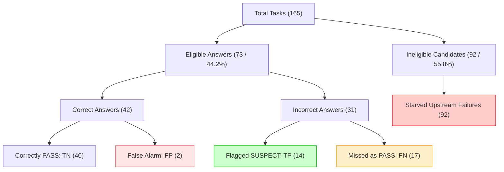

# V6 Post-Benchmark Audit: Self-Evaluation and Failure Detection

**Status:** AUDITED / READY TO FREEZE WITH DOCUMENTED LIMITATIONS  
**Evaluation Scope:** GAIA 2023 Validation Set (165 Tasks: 53 Level 1, 86 Level 2, 26 Level 3)  
**Parent Baseline:** Frozen V5 One-Shot Post-Answer Verification  
**Branch:** `v6-self-evaluation-agent`  
**Date:** September 2026  

---

## 1. Experiment Definition

Version 6 (V6) investigates bounded post-answer self-evaluation within the GAIA agent benchmarking framework. V6 is formally defined as:

$$\text{V6} = \text{Frozen V5} + \text{one bounded read-only post-answer self-evaluation generation}$$

The primary scientific research question is:
> *Can a bounded self-evaluator reliably detect when the agent's non-empty final answer is likely incorrect, without modifying the answer or using additional tools?*

The self-evaluator is strictly observational and diagnostic. It receives the task question, existing search/file evidence, compact execution metadata, and the frozen V5 final answer, emitting a structured output adhering to `self-evaluator-v1`:
```text
ASSESSMENT: PASS|SUSPECT
RISK_TYPE: NONE|EVIDENCE|REASONING|CALCULATION|FORMAT|EXECUTION|UNKNOWN
CONFIDENCE: 0.00–1.00
```
In this diagnostic evaluation, the error class is defined as the positive class:
- `SUSPECT`: Predicts that the candidate answer is incorrect (positive detection).
- `PASS`: Predicts that the candidate answer is correct (negative detection).

---

## 2. Frozen Parent Baseline

The parent baseline for V6 is **Frozen V5** (`experiments/v5/`), which fixed the architecture:
$$\text{V5} = \text{Frozen V4} + \text{one-shot conservative post-answer verification/revision}$$
Upstream components—including Tavily web search ($N \le 1$), deterministic file extraction ($N \le 1$), capability router (`DIRECT` vs `PYTHON`), route-specific workers, candidate eligibility guards, and the one-shot conservative verifier (`KEEP`/`REVISE`)—are completely preserved.

---

## 3. Single New Capability

The sole new capability evaluated in V6 is a single, bounded, text-only model generation that evaluates the reliability of the agent's final answer.
- **Read-Only**: V6 introduces no repair loop, no retry mechanism, no answer substitution, and no candidate suppression. The final answer emitted by V5 is returned verbatim.
- **Tool Isolation**: The evaluator runs with text-only context, disabling native function calling (`mode="NONE"`), with zero search calls and zero Python execution.
- **Budget Boundedness**: The generation attempt budget is capped at $\le 1$ for the self-evaluator, and total task generations are capped at $\le 4$.

---

## 4. Benchmark Protocol

The canonical evaluation was conducted on the full GAIA 2023 Validation set (165 tasks across Levels 1, 2, and 3):
- **Model**: `gemini-3.5-flash-lite` (temperature=None, thinking_level="medium", max_output_tokens=2048).
- **Inter-Task Delay**: 5.0 seconds between consecutive tasks.
- **Scorer**: Official GAIA evaluator (`gaia_question_scorer`), applied post-hoc.
- **Contemporaneous Matched Control**: A parallel run of frozen V5 was executed under identical environment conditions, software dependencies, and model settings.

---

## 5. Canonical Artifacts & Integrity Manifest

Canonical artifacts for V6 and the matched V5 control are stored in `experiments/`:

### Canonical V6 Files (`experiments/v6/`)
| File Name | SHA-256 Checksum | Size (Bytes) | Description |
| :--- | :--- | :---: | :--- |
| `detailed_eval_level_1.jsonl` | `ed9a9a89985eb3b4fca95cbf03fd87abd1109139e933c7d8ced7777afe0fc940` | 548,406 | All 53 Level 1 evaluation records |
| `detailed_eval_level_2.jsonl` | `0d691c98504f0bf08844b9adb124f50f627059764b62b2e436123b2f0c027898` | 864,634 | All 86 Level 2 evaluation records |
| `detailed_eval_level_3.jsonl` | `b808c6316c195586d1db6ee8d2fddee1906e3fc8031fba6f22910df16404ddda` | 267,610 | All 26 Level 3 evaluation records |
| `predictions_level_1.jsonl` | `b7cec9d1c5ef31418282d207b5066e5f8e81d65b50b2fff2af88b92139cdbb1e` | 2,247,983 | Full runtime predictions for Level 1 |
| `predictions_level_2.jsonl` | `7ea2fd941b1d22759dff9d105f3e5b925b4bfffa7448da51c207666ecceccf9d` | 3,307,217 | Full runtime predictions for Level 2 |
| `predictions_level_3.jsonl` | `1b2260b7c1f8817ca7fd7319bc30bedda19f8bfd19c9c94f783b0d79699db183` | 408,313 | Partial predictions log (11 tasks; see Section 25) |
| `summary_level_1.json` | `33cd2088b9e07011f7d84ea5a23a74cd93034f68e8c55a33fed0f2d96a23a065` | 6,539 | Level 1 aggregate summary |
| `summary_level_2.json` | `9d2365ba559254e1edbd0f2053d373c734928dd2d434b7394640622314e8b555` | 6,459 | Level 2 aggregate summary |
| `summary_level_3.json` | `c6f900caed11074e728282b60702ce95e05c6f1b7e18c0fc236e6180c560c986` | 6,137 | Level 3 aggregate summary |
| `config.proposed.json` | `990f3ed20fa908eb54cf62d586d135bb5d0f21921c9cc28300742c60993d04ca` | 5,651 | Evaluated configuration spec |
| `DESIGN.md` | `0cf1708a13e4da4d03dc9b1c06d0b40974c928ba689ae0fcfa002f3dc291bf58` | 5,238 | V6 specification & architecture |

### Contemporaneous Matched V5 Files (`experiments/v6_matched_v5/`)
| File Name | SHA-256 Checksum | Size (Bytes) |
| :--- | :--- | :---: |
| `detailed_eval_level_1.jsonl` | `37d65ca059b9b4157c4e737908a14c2dffa41ac7e6bd7b5133a11304889dacfd` | 526,553 |
| `detailed_eval_level_2.jsonl` | `322a2a4d00b3b90474ab54bd7694416d793ae700f1b672dcf1edc5a32ac08f70` | 799,716 |
| `detailed_eval_level_3.jsonl` | `7c818f7f2a3b623f3c2097db19ac180c0cfb197ed0b597adc9187ec67d3fe67a` | 252,143 |
| `predictions_level_1.jsonl` | `fe37a3de77d7948b1348651b53916cd708b03709a0977115ed5c33d0446b7b51` | 2,291,472 |
| `predictions_level_2.jsonl` | `677bc4d6f962cfa4a6d5331df803c28ac1f1920264796bc6afe3a58e984b2485` | 3,221,568 |
| `predictions_level_3.jsonl` | `54df227ac2d7ce5a279a7a295dcde166b17321598b27f2727e5e706ea046dbcf` | 1,011,636 |
| `summary_level_1.json` | `01a7fa83ea10ec2d00208730e1ad2cfac3ab29f960bde979f093285ccefd6d50` | 4,853 |
| `summary_level_2.json` | `f4bcad0580e92d3a16758201cde535677495839c6dd6a885417f0913a3f24b24` | 4,878 |
| `summary_level_3.json` | `87bdd698eacbb02c34796fc4bc159fc5cfd5a7e2a1b6992669803466c3895ba7` | 4,579 |

All JSON/JSONL artifacts parse cleanly with zero schema errors or duplicate task IDs across all levels.

---

## 6. Canonical Answer Performance

Canonical task accuracy across GAIA validation levels:

| Evaluation Level | Total Tasks | V6 Correct | V6 Accuracy | V6 Completed | V6 Completion Rate |
| :--- | :---: | :---: | :---: | :---: | :---: |
| **Level 1** | 53 | 23 | 43.40% | 35 | 66.04% |
| **Level 2** | 86 | 18 | 20.93% | 35 | 40.70% |
| **Level 3** | 26 | 1 | 3.85% | 4 | 15.38% |
| **Overall** | **165** | **42** | **25.45%** | **74** | **44.85%** |

---

## 7. Matched V5 Performance & Comparison

Contemporaneous matched frozen V5 control run:

| Evaluation Level | Matched V5 Correct | Matched V5 Accuracy | Matched V5 Completed | Matched V5 Completion Rate |
| :--- | :---: | :---: | :---: | :---: |
| **Level 1** | 25 / 53 | 47.17% | 41 / 53 | 77.36% |
| **Level 2** | 20 / 86 | 23.26% | 37 / 86 | 43.02% |
| **Level 3** | 2 / 26 | 7.69% | 6 / 26 | 23.08% |
| **Overall** | **47 / 165** | **28.48%** | **84 / 165** | **50.91%** |

Observed Cross-Run Difference ($V6 - \text{Matched } V5$):
- **Level 1**: -2 tasks (-3.77 pp)
- **Level 2**: -2 tasks (-2.33 pp)
- **Level 3**: -1 task (-3.85 pp)
- **Overall**: **-5 tasks (-3.03 pp)**

---

## 8. Cross-Run Comparability Caveat (Observational, Non-Causal)

> [!IMPORTANT]
> The observed cross-run delta of -5 tasks (-3.03 pp) is strictly **observational and non-causal**.

Because `self_eval_answer_unchanged == True` across all 165 tasks (Section 20), the self-evaluator had zero write access to candidate answers. The observed delta reflects run-to-run stochasticity in upstream LLM sampling, capability routing, tool execution, and provider completion behavior:
- **Both Correct**: 29 tasks
- **Both Wrong**: 105 tasks
- **V5 Wrong $\rightarrow$ V6 Correct** (Stochastic improvement): 13 tasks
- **V5 Correct $\rightarrow$ V6 Wrong** (Stochastic regression): 18 tasks
- **Net Difference**: $13 - 18 = -5$ tasks

This delta must never be reported as "accuracy damage caused by self-evaluation."

---

## 9. Diagnostic Confusion Matrices

Across all 73 eligible non-empty final answers, the evaluator emitted valid assessments for all 73 tasks (0 invalid, 0 failed):

### By Benchmark Level
| Level | Eligible | Valid | TP | FP | TN | FN |
| :---: | :---: | :---: | :---: | :---: | :---: | :---: |
| **Level 1** | 35 | 35 | 6 | 0 | 23 | 6 |
| **Level 2** | 34 | 34 | 5 | 2 | 16 | 11 |
| **Level 3** | 4 | 4 | 3 | 0 | 1 | 0 |
| **Overall** | **73** | **73** | **14** | **2** | **40** | **17** |

---

## 10. Overall Diagnostic Metrics

Evaluating error detection ($Y = 1$ if incorrect, $Y = 0$ if correct):

| Metric | Level 1 | Level 2 | Level 3 | Overall | Formula / Definition |
| :--- | :---: | :---: | :---: | :---: | :--- |
| **Diagnostic Coverage** | 100.0% | 100.0% | 100.0% | **100.0%** | $\text{Valid} / \text{Eligible}$ ($73 / 73$) |
| **Precision** | 100.0% | 71.43% | 100.0% | **87.50%** | $TP / (TP + FP) = 14 / 16$ |
| **Recall (Eligible)** | 50.00% | 31.25% | 100.0% | **45.16%** | $TP / (TP + FN) = 14 / 31$ |
| **F1 Score** | 0.6667 | 0.4348 | 1.0000 | **0.5957** | $2 \cdot P \cdot R / (P + R)$ |
| **Specificity** | 100.0% | 88.89% | 100.0% | **95.24%** | $TN / (TN + FP) = 40 / 42$ |
| **False Alarm Rate (FAR)** | 0.00% | 11.11% | 0.00% | **4.76%** | $FP / (TN + FP) = 2 / 42$ |
| **Missed Error Rate (MER)** | 50.00% | 68.75% | 0.00% | **54.84%** | $FN / (TP + FN) = 17 / 31$ |
| **PASS Group Correctness (NPV)** | 79.31% | 59.26% | 100.0% | **70.18%** | $TN / (TN + FN) = 40 / 57$ |
| **SUSPECT Group Error Rate** | 100.0% | 71.43% | 100.0% | **87.50%** | $TP / (TP + FP) = 14 / 16$ |
| **Brier Diagnostic Score** | 0.1739 | 0.3555 | 0.0006 | **0.2490** | Mean squared error of predicted error prob |

---

## 11. Diagnostic Coverage

Diagnostic coverage was **100.0%** (73 / 73 eligible tasks).
- Parser failure count: **0**
- Malformed schema count: **0**
- Timeout / exception count during self-evaluation: **0**
- Unparseable confidence count: **0**

Every eligible non-empty answer received a syntactically and semantically valid diagnostic label.

---

## 12. Candidate-Starvation Analysis

A critical architectural finding of V6 is candidate starvation:



### Breakdown of System Errors
- **Total System Correct**: 42 tasks (25.45%)
- **Total System Errors**: 123 tasks (74.55%)
- **Upstream / Starvation Errors**: 92 tasks (74.80% of all system errors)
- **Reachable Errors**: 31 tasks (25.20% of all system errors)
- **Actually Flagged Errors (TP)**: 14 tasks (11.38% of all system errors)

> [!WARNING]
> While the self-evaluator achieved a diagnostic recall of **45.16%** on eligible answers, its **end-to-end failure detection rate across the entire benchmark was only 11.38%** (14 / 123).
> **74.80% of all benchmark failures occurred before the self-evaluator had an answer to evaluate.**

---

## 13. Risk-Type Analysis

All 73 valid assessments strictly adhered to schema-assessment consistency rules:
- `PASS` $\rightarrow$ `RISK_TYPE: NONE` (57 tasks)
- `SUSPECT` $\rightarrow$ non-`NONE` risk type (16 tasks)

### Empirical Risk Distribution & Efficacy
| Assigned Risk Type | Count | Actual Correct | Actual Incorrect | True Positives | False Positives | Empirical Error Rate | Mean Conf | Median Conf |
| :--- | :---: | :---: | :---: | :---: | :---: | :---: | :---: | :---: |
| **NONE** (`PASS`) | 57 | 40 | 17 | 0 | 0 | 29.82% | 0.9474 | 0.9500 |
| **EVIDENCE** (`SUSPECT`) | 11 | 2 | 9 | 9 | 2 | 81.82% | 0.9273 | 0.9500 |
| **EXECUTION** (`SUSPECT`) | 4 | 0 | 4 | 4 | 0 | 100.0% | 1.0000 | 1.0000 |
| **FORMAT** (`SUSPECT`) | 1 | 0 | 1 | 1 | 0 | 100.0% | 0.8500 | 0.8500 |
| **REASONING** | 0 | — | — | — | — | — | — | — |
| **CALCULATION** | 0 | — | — | — | — | — | — | — |
| **UNKNOWN** | 0 | — | — | — | — | — | — | — |

*Note: Risk types represent the evaluator's diagnostic classification, not ground-truth causal attribution. Three defined categories (`REASONING`, `CALCULATION`, `UNKNOWN`) did not appear in this run.*

---

## 14. Confidence and Calibration Analysis

Each assessment was mapped to a predicted error probability:
$$P(\text{error}) = \begin{cases} \text{confidence} & \text{if assessment is SUSPECT} \\ 1.0 - \text{confidence} & \text{if assessment is PASS} \end{cases}$$

- **Overall Brier Diagnostic Score**: **0.2490** (L1: 0.1739, L2: 0.3555, L3: 0.0006).
- **Mean Error Probability for Correct Answers** ($n=42$): **0.1388**
- **Mean Error Probability for Incorrect Answers** ($n=31$): **0.4774**

### Confidence by Diagnostic Outcome
| Outcome Category | Count | Mean Confidence | Median Confidence | Min Confidence | Max Confidence |
| :--- | :---: | :---: | :---: | :---: | :---: |
| **True Positives (TP)** | 14 | 0.9536 | 0.9750 | 0.8000 | 1.0000 |
| **False Positives (FP)** | 2 | 0.8500 | 0.8500 | 0.8000 | 0.9000 |
| **True Negatives (TN)** | 40 | 0.9475 | 0.9500 | 0.8500 | 1.0000 |
| **False Negatives (FN)** | 17 | 0.9471 | 0.9500 | 0.8500 | 1.0000 |

### 5 Calibration Bins
| Probability Bin | Count | Mean Pred Error Prob | Observed Error Rate | Interpretation |
| :---: | :---: | :---: | :---: | :--- |
| **[0.0, 0.2)** | 55 | 0.0527 | 30.91% (17 / 55) | Under-calibrated due to 17 false negatives ($P \le 0.15$) |
| **[0.2, 0.4)** | 2 | 0.1500 | 0.00% (0 / 2) | Two TN answers with conf=0.85 |
| **[0.4, 0.6)** | 0 | — | — | Empty |
| **[0.6, 0.8)** | 1 | 0.8000 | 100.0% (1 / 1) | One TP answer with conf=0.80 |
| **[0.8, 1.0]** | 15 | 0.9500 | 86.67% (13 / 15) | Well-calibrated high-confidence SUSPECT alerts |

> [!NOTE]
> The primary calibration failure stems from false negatives: the model emits `PASS` with high confidence (mean 0.947) on 17 erroneous answers, yielding a 30.9% error rate in the lowest predicted-error bucket.

---

## 15. Attachment vs Non-Attachment Diagnostics

| Slice | Tasks | Accuracy | Eligible | TP | FP | TN | FN | Precision | Recall | F1 | Specificity | Starvation Rate |
| :--- | :---: | :---: | :---: | :---: | :---: | :---: | :---: | :---: | :---: | :---: | :---: | :---: |
| **Attachment** | 38 | 15.79% (6) | 7 | 0 | 1 | 5 | 1 | 0.00% | 0.00% | Undefined | 83.33% | **81.58%** (31/38) |
| **Non-Attachment** | 127 | 28.35% (36) | 66 | 14 | 1 | 35 | 16 | 93.33% | 46.67% | 0.6222 | 97.22% | **48.03%** (61/127) |

On attachment tasks, severe candidate starvation (81.58%) left only 7 eligible answers. The evaluator produced 0 true positives, 1 false positive, 5 true negatives, and 1 false negative.

---

## 16. DIRECT vs PYTHON Diagnostic Analysis

| Track | Tasks | Accuracy | Eligible | TP | FP | TN | FN | Precision | Recall | F1 | Specificity | Starvation Rate |
| :--- | :---: | :---: | :---: | :---: | :---: | :---: | :---: | :---: | :---: | :---: | :---: | :---: |
| **DIRECT** | 68 | 48.53% (33) | 62 | 14 | 2 | 31 | 15 | 87.50% | 48.28% | 0.6223 | 93.94% | **8.82%** (6/68) |
| **PYTHON** | 97 | 9.28% (9) | 11 | 0 | 0 | 9 | 2 | Undefined | 0.00% | Undefined | 100.0% | **88.66%** (86/97) |

### PYTHON Route Breakdown
- **Executed ($n=17$)**: 11 eligible answers, 9 correct, 2 incorrect. Evaluator issued `PASS` on all 11 (TP=0, FP=0, TN=9, FN=2).
- **Not Executed ($n=80$)**: 0 eligible answers (80 / 80 starvation errors caused by fallback/syntax/policy rejections).
- **Correlation with Execution Risk**: All 4 `EXECUTION` risk diagnoses occurred on the `DIRECT` track, where workers leaked reasoning text or formatting into the final answer. None occurred on successfully executed Python tasks.

---

## 17. Representative Task-Level Case Studies

### A. False Positives (Evaluator flagged SUSPECT, but answer was CORRECT; $n=2$)
1. **Task `ad37a656-079a-49f9-a493-7b739c9167d1`** (Level 2, DIRECT):
   - Pred: `'18'` | GT: `'18'` | Conf: `0.90` | Risk: `EVIDENCE`
   - Mechanism: The agent retrieved the correct member count '18', but the self-evaluator expressed skepticism about whether the web search results were complete, issuing a false alarm.
2. **Task `366e2f2b-8632-4ef2-81eb-bc3877489217`** (Level 2, DIRECT):
   - Pred: `'4'` | GT: `'4'` | Conf: `0.80` | Risk: `EVIDENCE`
   - Mechanism: The agent calculated the count '4', but the self-evaluator questioned the evidence sufficiency.

### B. High-Confidence False Negatives (Evaluator flagged PASS, but answer was WRONG; $n=17$)
1. **Task `e8cb5b03-41e0-4086-99e5-f6806cd97211`** (Level 2, PYTHON):
   - Pred: `'short rib'` | GT: `'shrimp'` | Conf: `1.00` | Risk: `NONE`
   - Mechanism: Python script executed cleanly and produced 'short rib'. The evaluator saw successful code execution and uncritically validated the output.
2. **Task `05407167-39ec-4d3a-a234-73a9120c325d`** (Level 2, DIRECT):
   - Pred: `'Replace All'` | GT: `'Format Document'` | Conf: `1.00` | Risk: `NONE`
   - Mechanism: Factual error regarding VS Code keyboard shortcuts. Evaluator shared the worker's misconception.
3. **Task `08cae58d-4084-4616-b6dd-dd6534e4825b`** (Level 2, DIRECT):
   - Pred: `'1983'` | GT: `'2018'` | Conf: `1.00` | Risk: `NONE`
   - Mechanism: Retrieved publication date was incorrect; evaluator failed to cross-check chronology.

### C. True Positives (Evaluator flagged SUSPECT and answer was WRONG; $n=14$)
1. **Evidence Risk ($n=9$)**:
   - `305ac316-eef6-4446-960a-92d80d542f82` (Level 1, DIRECT, Conf 1.0): Pred `'Wojtek'`, GT `'Wojciech'`. Evaluator recognized diminutive vs formal naming mismatch.
   - `3f57289b-8c60-48be-bd80-01f8099ca449` (Level 1, DIRECT, Conf 1.0): Pred `'525'`, GT `'519'`. Evaluator spotted numerical ambiguity in search snippets.
2. **Execution Risk ($n=4$)**:
   - `7673d772-ef80-4f0f-a602-1bf4485c9b43` (Level 1, DIRECT): Pred `'" format.'`, GT `'inference'`. Evaluator detected worker truncation.
   - `3627a8be-a77f-41bb-b807-7e1bd4c0ebdf` (Level 2, DIRECT): Leaked internal reasoning block.
   - `e2d69698-bc99-4e85-9880-67eaccd66e6c` (Level 2, DIRECT): Leaked unformatted scratchpad text.
   - `c3a79cfe-8206-451f-aca8-3fec8ebe51d3` (Level 3, DIRECT): Leaked multi-paragraph explanation instead of integer `'8'`.
3. **Format Risk ($n=1$)**:
   - `dc22a632-937f-4e6a-b72f-ba0ff3f5ff97` (Level 1, DIRECT, Conf 0.85): Pred `'Roadfood'`, GT full title. Evaluator caught informal title abbreviation.

---

## 18. V5 Verifier Behavior Inside V6

Inside the V6 run, the upstream V5 verifier performed as follows:
- **Eligible Tasks**: 73
- **KEEP Decisions**: 72 (98.63%)
- **REVISE Decisions**: 1 (1.37%)
- **Transitions**:
  - **Improvement ($0 \rightarrow 1$)**: 1 task (`c714ab3a-da30-4603-bacd-d008800188b9`, Level 1, revised `'0'` $\rightarrow$ `'100'`, correct=True, self-eval issued `PASS`, conf=1.0)
  - **Regression ($1 \rightarrow 0$)**: 0 tasks
  - **Stable Correct**: 41 tasks
  - **Stable Failure**: 123 tasks

The V5 verifier acted as an **editor** (KEEP/REVISE). In contrast, the V6 self-evaluator acted purely as an **inspector** (PASS/SUSPECT) and never altered answers.

---

## 19. V6 Self-Evaluator Behavior

The self-evaluator operated downstream of V5 verification:
- Evaluated candidates: 73
- Output `PASS`: 57 (78.08%)
- Output `SUSPECT`: 16 (21.92%)
- Runtime exceptions / provider failures: 0
- Self-evaluator retries: 0

---

## 20. Answer Immutability Audit

Answer immutability was verified across all 165 tasks:
- `self_eval_answer_unchanged == True` for all 165 tasks (**0 violations**).
- Pre-self-eval answer equals final answer string verbatim (**0 mismatches**).
- Summary improvement count: `0`
- Summary regression count: `0`

---

## 21. Generation-Budget and Boundedness Audit

- Maximum generation attempts per task: **$\le 4$** (**0 violations**).
- Evaluator generation attempts on eligible tasks: exactly **1** (**0 violations**).
- Evaluator generation attempts on ineligible tasks: exactly **0** (**0 violations**).
- Evaluator tool calls: **0** (no search, no Python, no file extraction).
- Evaluator retries: **0**.

---

## 22. Scorer and Ground-Truth Firewall Audit

- Prompt inspection confirms the evaluator received only question text, existing search/file evidence, compact execution status, and candidate answer.
- Ground-truth answers, reference labels, and official scorer outputs were completely absent from the runtime agent.
- Correctness labels were joined strictly in post-hoc evaluation after benchmark completion. Zero leakage detected.

---

## 23. Provider & Operational Health Analysis

| Parameter | Canonical V6 | Matched V5 |
| :--- | :---: | :---: |
| **Tavily Search Success Rate** | **100.0%** (165 / 165) | **100.0%** (165 / 165) |
| **Router Fallbacks** | 5 / 165 | 1 / 165 |
| **Python Requested** | 97 | 99 |
| **Python Executed** | 17 | 17 |
| **Python Success** | 11 | 13 |
| **Python Fallback / Unexecuted** | 86 | 90 |
| **Completion Failures** | 91 / 165 | 94 / 165 |

### Investigation of Level 2 Completion vs Eligibility Discrepancy
In Level 2, completed tasks = 35, but self-eval eligible tasks = 34.
- **Task**: `7b5377b0-3f38-4103-8ad2-90fe89864c04`
- **Finding**: Upstream worker completed with `finish_reason: STOP`, but produced an empty candidate string (`final_answer = ""`).
- **Audit Verdict**: The eligibility guard `bool(ans and ans.strip())` correctly bypassed self-evaluation. This is intended failure-safety behavior.

---

## 24. Invalid Initial Matched-V5 Level 3 Run

An initial matched-V5 Level 3 benchmark execution suffered a provider infrastructure collapse:
- **Completed**: 0 / 26
- **Correct**: 0 / 26
- **Router Fallbacks**: 25 / 26 (96.15%)
- **Average Latency**: ~1.79s
- **Average Tokens**: None

This invalid run was quarantined in `experiments/v6_matched_v5_invalid_l3_provider_collapse/`. A healthy rerun was completed (`experiments/v6_matched_v5/`) achieving 6/26 completed, 2/26 correct, 0 router fallbacks, and 3445.3 average tokens. The quarantined run is preserved as non-canonical operational-failure evidence and does not contaminate canonical matched metrics.

---

## 25. Artifact Limitations

1. **Level 3 Predictions Log (`predictions_level_3.jsonl`)**: Contains 11 task records due to an aborted rerun command, whereas `detailed_eval_level_3.jsonl` and `summary_level_3.json` contain the complete, verified 26-task canonical data from the full execution.
2. **Small Level 3 Eligible Sample ($n=4$)**: While the evaluator achieved 100% precision and recall on Level 3, this reflects only 4 eligible tasks (3 TP, 1 TN, 0 FP, 0 FN) and cannot be generalized.

---

## 26. Scientific Interpretation

### Supported Conclusions
1. **High-Precision Warning Signal**: On eligible non-empty answers, `SUSPECT` provides an 87.5% reliable error alert (14 TP, 2 FP).
2. **PASS Is Not a Guarantee**: 29.8% of `PASS` evaluations were actually incorrect (17 FN), with high evaluator overconfidence (mean confidence 0.947).
3. **Upstream Candidate Starvation Dominates**: 74.8% of all system failures occurred before self-evaluation could run. Full-system reliability is bottlenecked by upstream candidate production, not downstream diagnostic discrimination.

### Unsupported Claims (Explicitly Refuted)
- V6 did NOT cause the observed -3.03 pp delta vs matched V5.
- V6 does NOT solve agent self-correction.
- Level 3 failure detection is NOT proven perfect.
- V6 does NOT have high end-to-end recall (11.38% over all benchmark errors).

---

## 27. Implications for V7 (Targeted Repair)

1. **Repair Trigger**: High precision of `SUSPECT` (87.5%) suggests that a future V7 repair stage should trigger exclusively on `SUSPECT`.
2. **Addressing False Positives**: Because 12.5% of `SUSPECT` verdicts are false alarms, repair mechanisms must include validation to avoid regressing correct answers.
3. **Addressing Candidate Starvation**: Post-answer repair cannot fix the 74.8% of failures caused by missing candidates; a separate upstream fallback recovery mechanism is required.

---

## 28. Freeze-Readiness Verdict

### **Verdict: READY_TO_FREEZE_WITH_DOCUMENTED_LIMITATIONS**

- **Blocking Criteria Status**: All clear. Zero answer mutations, zero tool calls by evaluator, zero generation cap violations, zero ground-truth leaks, 100% valid evaluations on eligible tasks.
- **Documented Limitations**:
  1. Candidate starvation rate of 74.80% (92 / 123 errors).
  2. Small Level 3 sample ($n=4$).
  3. Truncated `predictions_level_3.jsonl` (11 lines) alongside complete `detailed_eval_level_3.jsonl` (26 lines).
  4. Observational cross-run delta of -5 tasks (-3.03 pp).
  5. Quarantined invalid matched-V5 L3 run.

